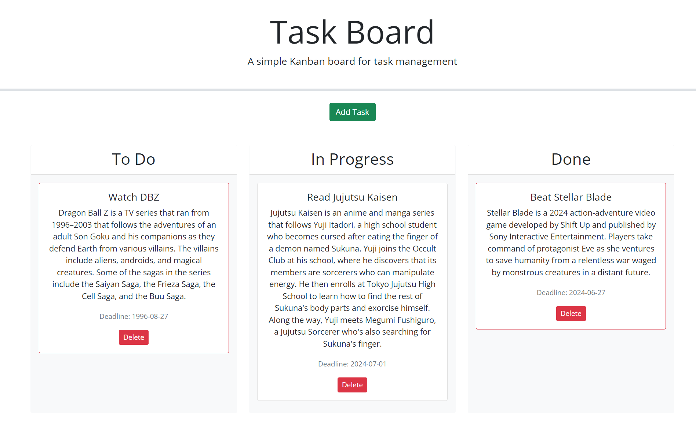

# Task Board Project

## Overview

A simple Kanban board for task management, allowing users to add, manage, and track the progress of individual project tasks. The project uses HTML, CSS, and JavaScript, along with jQuery, Bootstrap, and day.js.

## Features

- **Task Management**: Add, edit, and delete tasks.
- **Progress Tracking**: Move tasks between columns (To Do, In Progress, Done).
- **Persistence**: Tasks are stored in localStorage.
- **Deadline Indicators**: Tasks are color-coded based on deadlines (yellow for nearing, red for overdue).

## Usage

Open `index.html` in your web browser to start using the task board. Add tasks, drag and drop to update progress, and delete tasks as needed.

## Screenshot

## Live Demo

Check out the live demo on GitHub Pages: [Task Board Live Demo](https://enduringtimes.github.io/Taskboard/)